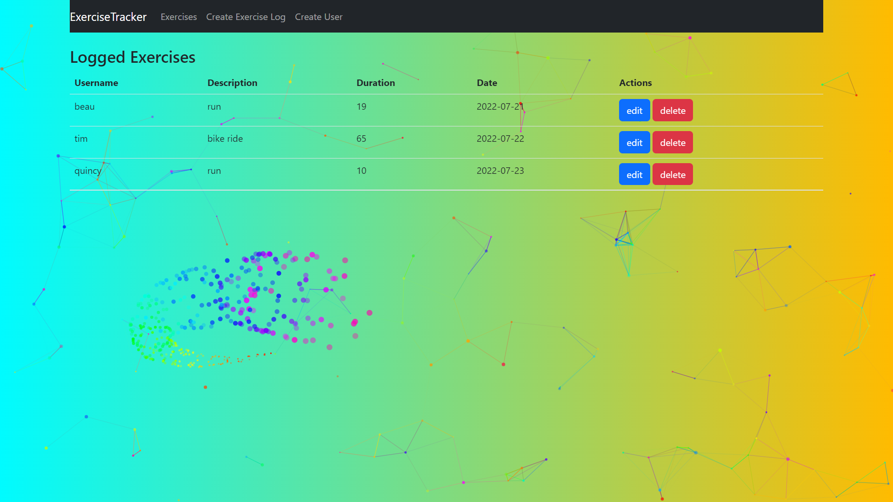

# MERN- Exercise Tracker

Exercise Tracker is a web application that can keep track of different exercises with duration for different users .Using React.js in front-end and Node.js in backend with Express.js, as well as a MongoDB database.

## Technologies Used

### Front-End

* HTML5
* CSS3
* ReactJS
* Bootstrap
* Tspartices

### Back-End

* Node.js
* Express.js
* MongoDB
* Mongoose
